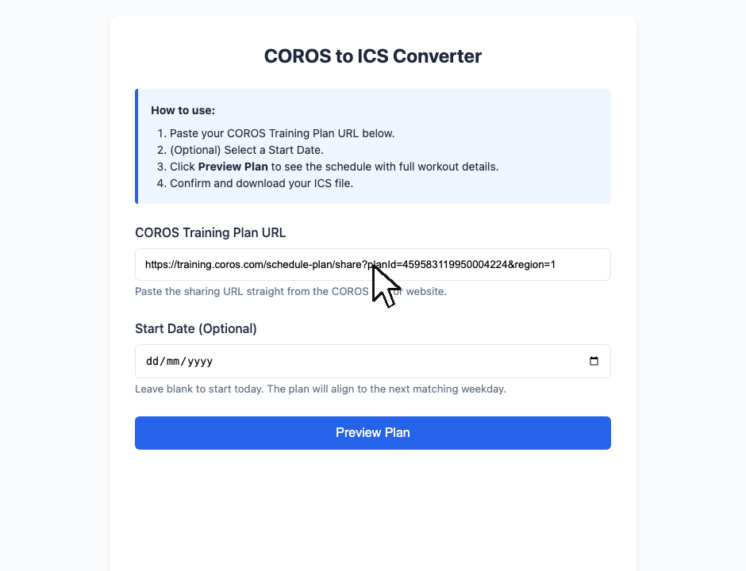
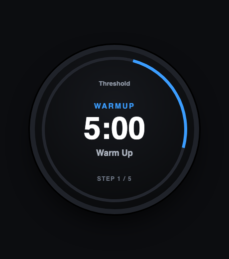

# COROS Training Plan Exporter

[](https://github.com/winnwy/COROS-Training-Plan-Exporter/actions/workflows/ci.yml)

**Get your COROS training plan — or a single workout — out of the COROS app, into your calendar or onto your Garmin watch.**

COROS plans and workouts live inside the COROS app. This tool reads one from its public link, decodes it into plain English, and hands it back to you as a **calendar you can subscribe to** or **structured workouts your watch can guide you through**.

### ▶️ [**Try it now → coros-training-plan-exporter.vercel.app**](https://coros-training-plan-exporter.vercel.app/)

No sign-up, no install. Paste a plan **or** workout link, preview it, download.



---

## Two ways to use it

```
   a COROS plan link ──┐   ┌─────────────────────────────┐
                       ├──►│  COROS Training Plan Exporter │ ──►  📅 calendar (.ics)
   a COROS workout ────┘   └─────────────────────────────┘ ──►  ⌚ Garmin workouts (.FIT)
```

A **plan** link (`planId=`) becomes a multi-week calendar / a set of `.FIT` files. A single **workout** link (`programId=`) becomes one dated event / one `.FIT`.

### 🏃 If you just want to follow your plan
Use the [web app](https://coros-training-plan-exporter.vercel.app/). Paste your plan **or workout** link and get either:
- **A calendar** (`.ics`) — every workout on the right day in Google / Apple / Outlook, with the full breakdown in each event.
- **Garmin watch workouts** (`.FIT`) — download, copy to your watch, and it guides you through warm-up, intervals, and cool-down.

No coding required. [Jump to the how-to →](#-how-to-use-the-web-app)

### 🛠️ If you're a developer
Run it locally, use the CLI, or build on the shared decoder (`coros_decode.py`) that turns a COROS plan into a normalized workout model feeding every export format. [Jump to dev setup →](#run-it-yourself)

---

## What you get

### 📅 Calendar (`.ics`)
One event per workout, dated to your start day. For **run, bike, and strength**, each event carries the full decoded workout:

> **Threshold** — Tue 24 Jun
> ```
> Duration: 60min · Training Load: 103
> This should not feel like an easy session (RPE 8/10)...
>
> Workout:
>  • Warm Up — open
>  • Training — 30min @ 80–90% HR
> 3×
>    • Training — 5min @ 96–102% HR
>    • Rest — 5min @ 80–90% HR
>  • Cool Down — open
> ```

Intervals show as repeats (`3× …`), targets as %-of-threshold ranges, and strength as `sets × reps @ weight` (e.g. `Deadlifts with Bands — 3×10 @ 6.8 kg`).

### ⌚ Garmin watch (`.FIT`)
A calendar event is just a reminder. A `.FIT` workout is **watch-guided** — your Garmin steps you through it. Works for **run, bike, and strength** (sets become repeats). Download from the web app, or use the CLI.



*Roughly how it plays out on the watch (illustration): each step shows its target and time, counting you through the workout.*

**Put it on your watch (USB sideload):**
1. Download the `.FIT` `.zip` (web button or CLI) and unzip it.
2. Plug your watch in over USB — it mounts as a **GARMIN** drive. Copy the `.fit` file(s) into **`GARMIN/NewFiles/`** (some models: `GARMIN/Workouts/`). On macOS, MTP-only watches need [Android File Transfer](https://www.android.com/filetransfer/).
3. Eject, unplug. The workout appears under **Training → Workouts** — start it and the watch counts you through each step.

> **Note:** durations, distances, reps and interval repeats are exact, but the intensity target rides in the step name (e.g. `Training @ 96–102% HR`) rather than an enforced zone — COROS uses %-of-threshold, which doesn't map cleanly onto Garmin's zone model. Older watches cap stored workouts (~25–50), so load a few at a time.

---

## 📲 How to use the web app

1. Open **[the app](https://coros-training-plan-exporter.vercel.app/)**.
2. Paste a COROS **plan** link (`planId=`) or a single **workout** link (`programId=`) — from the COROS app's share button, or [coros.com/training](https://coros.com/training).
3. *(Optional)* pick a start date — blank means today. For a plan it aligns to the first weekday; for a single workout it's just the day the event lands on.
4. **Preview** the schedule (a plan shows every week; a workout shows one event).
5. Download **`.ics`** (calendar) or **Garmin `.FIT`** (watch). A single workout downloads as one `.fit`; a plan as a `.zip` of `.fit` files.
6. Import the `.ics` into your calendar, or copy the `.fit` file(s) to your watch's `GARMIN/NewFiles/` folder over USB.

---

## Run it yourself

**Requirements:** Python 3.10+ and an internet connection.

```bash
git clone https://github.com/winnwy/COROS-Training-Plan-Exporter.git
cd COROS-Training-Plan-Exporter
python3 -m venv venv && source venv/bin/activate   # Windows: venv\Scripts\activate
pip install -r requirements.txt
```

**Web app**
```bash
python3 app.py          # then open http://127.0.0.1:5000
```

**CLI — calendar**
```bash
# a plan -> coros_training_plan.ics (multi-week)
python3 convert_to_ics.py --url "https://training.coros.com/schedule-plan/share?planId=<ID>&region=1" --start 2026-07-01

# a single workout -> coros_workout.ics (one dated event)
python3 convert_to_ics.py --url "https://training.coros.com/workout-program?programId=<ID>&region=1" --start 2026-07-01
# --start is optional; omit for an interactive prompt (a workout defaults to today)
```

**CLI — Garmin `.FIT`**
```bash
python3 coros_to_fit.py --plan <ID> --out ./fit_out      # one .fit per run/bike/strength workout in the plan
python3 coros_to_fit.py --workout <ID> --out ./fit_out   # one .fit for a single workout
# copy the .fit file(s) to the watch's GARMIN/NewFiles/. Swim/climb workouts aren't .FIT-exportable yet — use the calendar.
```

---

## How it works

COROS stores workout details as shortcodes (`T3001`, `P12999`, …). The tool fetches a plan or workout from the **public** COROS API, decodes those shortcodes via a bundled dictionary into a normalized workout model, and renders that model into each output format:

```
COROS plan link ─────► teamapi.coros.com/training/plan/detail     (public API, no login)
COROS workout link ──► teamapi.coros.com/training/program/detail
        └─ coros_decode.py   decode shortcodes → Step / RepeatGroup / Workout model
             ├─ convert_to_ics.py   → 📅 .ics calendar (rich run/bike/strength detail)
             ├─ coros_to_fit.py     → ⌚ Garmin .FIT workouts (sideload to watch)
             └─ poc/coros_to_zwo.py → 🧪 .ZWO / intervals.icu (experimental)
```

A standalone workout is just one program, so it reuses the exact same decoder (`decode_workout` wraps it as a one-program plan).

One decoder, many exporters — so the calendar and the watch always agree.

## Project layout

| Path | What |
|---|---|
| `app.py` | Flask web app (UI + routing) |
| `convert_to_ics.py` | URL scraping, date alignment, `.ics` generation |
| `coros_to_fit.py` | Garmin `.FIT` workout exporter (run/bike/strength) |
| `coros_decode.py` | Shared decoder → normalized workout model |
| `coros_dictionary.json` | Shortcode → natural-language dictionary (~7,100 entries) |
| `scripts/refresh_dictionary.py` | Re-pull the dictionary from COROS's locale bundle (run when codes show as raw `W302xx`) |
| `templates/` | Web frontend (`index.html`, `preview.html`) |
| `poc/` | `.ZWO` / intervals.icu proof of concept |
| `tests/` | pytest + committed raw API fixtures. Run: `pip install -r requirements-dev.txt && python -m pytest tests/` (CI runs this on every push/PR) |
| `docs/` | [Build plan](docs/BUILD_PLAN.md) · [full site map](docs/coros_map/COROS_MAP.md) · [follow-ups](docs/FOLLOWUPS.md) |

## Status

| | |
|---|---|
| ✅ Plan export — `.ics` + `.FIT`, rich detail for run / bike / strength | shipped |
| ✅ Single workout export — paste a `programId=` link → one `.ics` event / one `.FIT` | shipped |
| 🧪 `.ZWO` / intervals.icu structured export | experimental (POC) |
| 🔬 Direct Garmin Connect upload (unofficial API) | researched, not built |
| 🚧 Swim / triathlon / climbing | calendar at overview level only (no `.FIT`) |

## License

MIT
